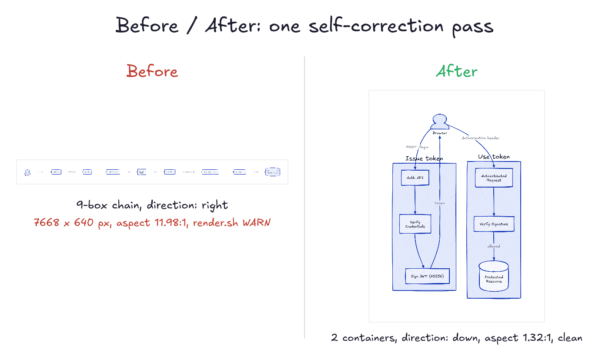

# sketchloop

Sketchloop is an [agent skill](https://agentskills.io) that lets your coding agent create beautiful, hand-drawn-looking
diagrams. Ask it to *"draw this as a hand-drawn diagram"* and you get back a real
**image**: the agent writes a [D2](https://d2lang.com) text file, renders it to a sketchy
hand-drawn PNG **completely offline**, then **looks at the rendered image and fixes its
own diagram** in a short loop.


## Why sketchloop

I often find it hard to understand complex ideas just by reading text in a terminal. I'm
a visual learner, so I like having my agent draw me an image instead. Those drawings were
hit or miss though: broken layouts, unreadable labels, heavyweight browser tooling behind
the scenes. I built sketchloop to get consistent, nice-looking diagrams.

Sketchloop needs no browser, no Node, no network. The only dependencies are two
single-binary CLIs: [`d2`](https://d2lang.com) (the agent describes the diagram as text,
d2 does the layout) and [`resvg`](https://github.com/linebender/resvg) (rasterizes it to a
PNG); the hand font is bundled. The skill tells the agent to **look at the rendered PNG
and keep fixing the diagram until it looks good** (hence, sketch*loop*), plus a few heuristics
that keep diagrams readable (split oversized graphs, cap chain lengths, short labels). It
works in any agent that can run a shell and view an image: Claude Code, Cursor, Copilot
CLI, Codex CLI.

You get three files back: the **`.png`** (to view/share), the **`.svg`** (vector,
self-contained, hand-drawn in any browser), and the editable **`.d2`** source.

## Install

First the two render dependencies, both browser-free single binaries (other install
routes under [Requirements](#requirements)):

```bash
brew install d2 resvg          # macOS / Homebrew on Linux
```

Then the skill itself:

```bash
git clone https://github.com/alexander-posztos/sketchloop
bash sketchloop/install.sh        # -> ~/.claude/skills/sketchloop; checks deps, verifies a render
```

`install.sh` copies the runtime files, tells you what to install if `d2`/`resvg` are missing
(it never installs anything itself; re-run with `--force` to overwrite an existing install),
and verifies the result with a real render. Pass a
directory to install elsewhere (e.g. `bash sketchloop/install.sh .claude/skills/sketchloop`
for per-project). It's all just a self-contained folder, so manual install works too:

```bash
# Claude Code, personal (every project) or per-project:
cp -R sketchloop ~/.claude/skills/sketchloop
cp -R sketchloop .claude/skills/sketchloop
# or symlink a checkout so `git pull` keeps it current:
ln -s "$PWD/sketchloop" ~/.claude/skills/sketchloop
```

The command name comes from the folder, so keep it named `sketchloop` (invoke with
`/sketchloop`, or just ask in plain language). Restart Claude Code once after first adding it.
Other harnesses read the same format from their own skill directories, e.g. `~/.agents/skills`
(the cross-tool location), `~/.copilot/skills` or `.github/skills` (GitHub Copilot),
`.agents/skills` (Codex CLI), or point the agent at `SKILL.md` directly. `CLAUDE.md` and
`test.sh` are dev-only; the skill itself needs `SKILL.md`, `render.sh`, `reference/`,
`assets/`, and `examples/` (referenced from `SKILL.md`).

## Use

Ask in plain language:

> "Draw a hand-drawn architecture diagram of this repo: the main components and how they talk to each other."

The agent writes a `.d2`, renders it, checks the PNG, and drops the result into a
`sketches/` folder under your working directory (one place to gitignore or delete; name a
different spot in the request if you want). You can also drive the renderer yourself:

```bash
./render.sh mydiagram.d2   # -> writes mydiagram.svg + mydiagram.png, prints the PNG path
```

## How it works

```
diagram.d2  --[ d2 --sketch ]-->  diagram.svg  --[ font rewrite + resvg ]-->  diagram.png
```

The agent writes the diagram as `.d2` text and `render.sh` turns it into a hand-drawn PNG.
One catch I had to work around: SVG rasterizers ignore the hand font D2 embeds, so the
text would come out in a boring system sans. `render.sh` rewrites the SVG to use the
bundled Excalifont before handing it to `resvg`, so the letters stay hand-drawn too. (D2
has a native PNG export, but it quietly downloads a ~140 MB headless Chromium; the skill
never touches it.)

### The self-correction loop

The loop matters when a first draft comes out wrong. Real example: a JWT flow
written as one long chain renders as an unreadable 7668 x 640 strip. The agent reads the
PNG, sees the strip, regroups the chain into two containers, and re-renders clean. It
stops after ~2-3 passes.



## Requirements

- [`d2`](https://d2lang.com): single Go binary (verified on 0.7.1). `brew install d2`, the
  installer script at d2lang.com, or `go install oss.terrastruct.com/d2@latest`.
- [`resvg`](https://github.com/linebender/resvg): single Rust binary (verified on 0.47.0;
  older versions untested). `brew install resvg`, `cargo install resvg`, or a release binary.
- Windows: `d2` and `resvg` are native single binaries, but `render.sh` is bash; run it
  via Git Bash or WSL.

## Credit

sketchloop is built on [D2](https://d2lang.com) (the diagram language and its `--sketch`
mode) and [Excalifont](https://plus.excalidraw.com/excalifont), Excalidraw's own hand font
(SIL OFL 1.1). The browser-free rendering idea came from [`h0rv/d2-mcp`](https://github.com/h0rv/d2-mcp)
and [`i2y/d2mcp`](https://github.com/i2y/d2mcp), and the look-and-fix loop was inspired by
[`coleam00/excalidraw-diagram-skill`](https://github.com/coleam00/excalidraw-diagram-skill).

## License

MIT for the skill (code, docs, examples). The bundled font is licensed separately under the
[SIL Open Font License 1.1](assets/Excalifont-OFL.txt).
</content>
